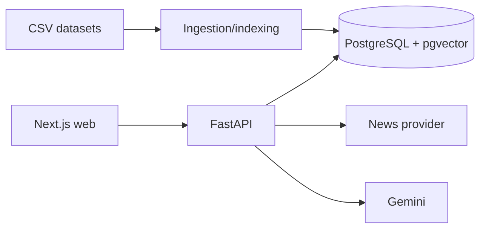

# Architecture

## System overview

## Data and retrieval

Companies, problems, mappings, sectors, and news are converted to typed knowledge documents. The chunker preserves document ID, type, chunk ID, and metadata. Gemini embeddings are stored in pgvector and semantic retrieval applies a similarity threshold before an LLM receives context. Citation responses are built directly from retrieved chunk metadata; no source is fabricated.

## News and discovery

News is fetched per company, relevance-scored, deduplicated by source URL, stored, and indexed. Admin discovery produces pending candidates with evidence; a human must approve them. Approval checks duplicates, persists the company, and triggers single-document indexing.

## Scaling and trade-offs

The current indexing path is synchronous and intentionally simple for the dataset size. At larger scale, move ingestion/news refresh to workers, batch embeddings, use a managed pgvector service, and add authentication/role-based admin access. Discovery is constrained to evidence-backed retrieval; an external research provider can be added behind that boundary when broader discovery is required.
