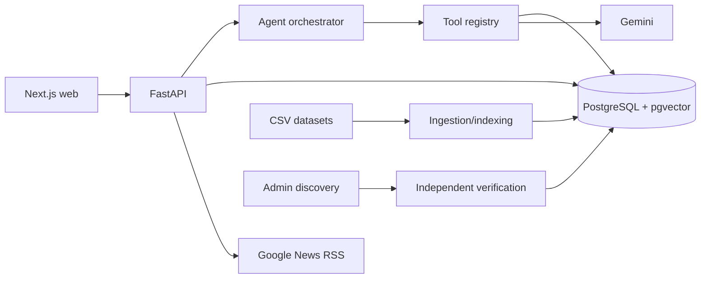
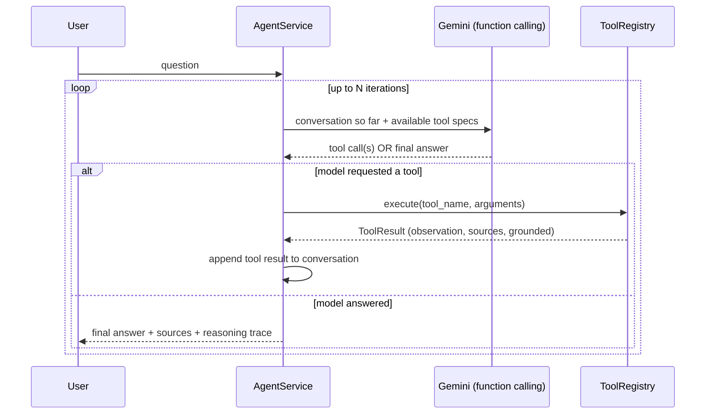
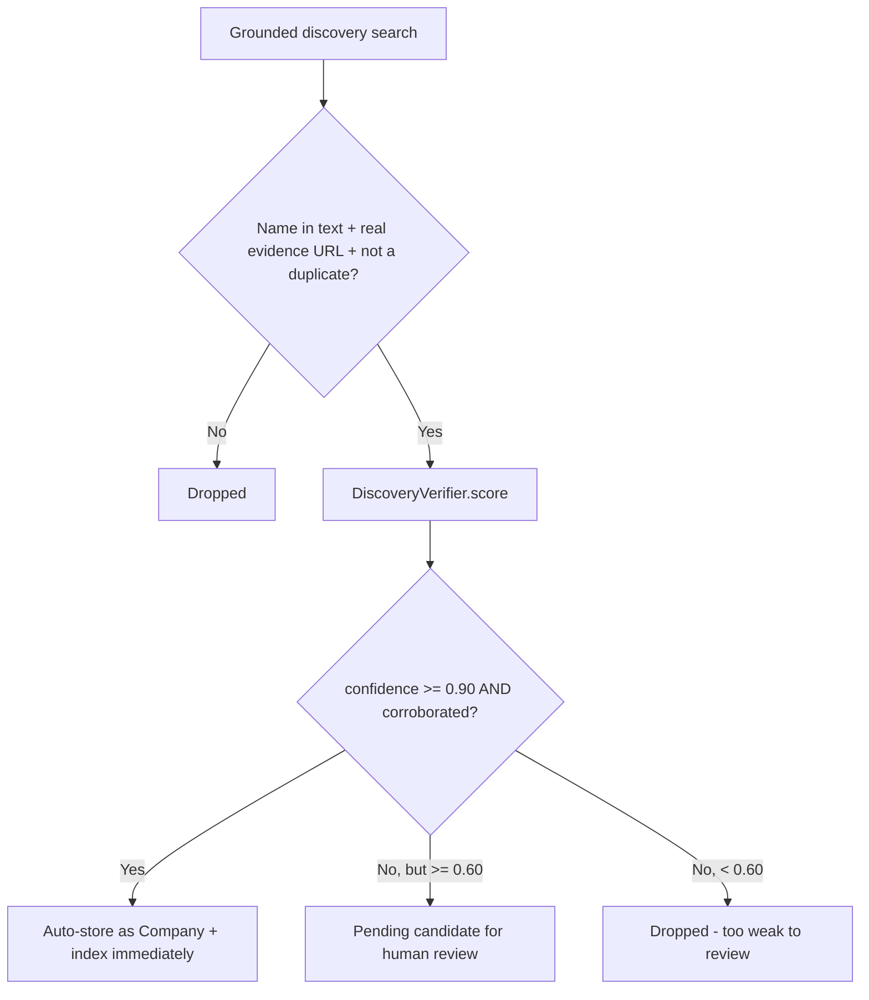

# Architecture

## System overview

```mermaid
flowchart LR
  Web[Next.js web] --> API[FastAPI]
  API --> Agent[Agent orchestrator]
  Agent --> Tools[Tool registry]
  Tools --> DB[(PostgreSQL + pgvector)]
  Tools --> LLM[Gemini]
  API --> DB
  API --> News[Google News RSS]
  CSV[CSV datasets] --> Ingest[Ingestion/indexing] --> DB
  Admin[Admin discovery] --> Verify[Independent verification]
  Verify --> DB
```

## Data and retrieval

Companies, problems, mappings, sectors, and news are converted to typed knowledge documents. The chunker preserves document ID, type, chunk ID, and metadata. Gemini embeddings are stored in pgvector and semantic retrieval applies a similarity threshold (0.60) before an LLM receives context. Citation responses are built directly from retrieved chunk metadata; no source is fabricated. Re-indexing compares stored chunk content byte-for-byte before re-embedding, so re-running ingestion on unchanged data costs zero embedding API calls.

## AI Agent (reason + act)

The original `/ai/ask` endpoint remains: a single-shot RAG call that either answers from retrieved context or refuses. It's still the simplest, cheapest path for a pure knowledge-base question, and it's kept as-is rather than replaced.

Alongside it, `/agent/ask` adds a genuine reason-and-act loop (`AgentService`) that can call multiple capabilities in sequence and reason over the results before answering:

```mermaid
sequenceDiagram
  participant U as User
  participant A as AgentService
  participant L as Gemini (function calling)
  participant T as ToolRegistry

  U->>A: question
  loop up to N iterations
    A->>L: conversation so far + available tool specs
    L-->>A: tool call(s) OR final answer
    alt model requested a tool
      A->>T: execute(tool_name, arguments)
      T-->>A: ToolResult (observation, sources, grounded)
      A->>A: append tool result to conversation
    else model answered
      A-->>U: final answer + sources + reasoning trace
    end
  end
```

**Design decisions:**

- **The model only ever chooses; the code always executes.** Gemini's automatic function calling is explicitly disabled (`AutomaticFunctionCallingConfig(disable=True)`). Every tool invocation is visible, logged, and returned to the client as a `steps` trace — an agent that silently decides what to do is neither debuggable nor trustworthy in a business context where a wrong vendor recommendation has real cost.
- **Four tools, deliberately not more:**
  - `search_knowledge_base` — semantic RAG over the existing vector store (companies, sectors, problems, news). Reuses the existing 0.60 similarity floor and citation service unchanged.
  - `query_company_directory` — exact SQL filtering/counting. Added because vector search structurally cannot answer "how many" or "list all" correctly (top-k similarity returns the k most similar, not the complete set) — a common blind spot in RAG-only chatbots.
  - `get_company_news` — company-attributed news lookup in correct chronological order, backed by the news-monitoring pipeline below.
  - `web_search` — Gemini's Google Search grounding, for anything outside the curated dataset. This is what makes the agent answer general questions, not just directory questions, per the brief.
- **A bounded loop, not an open-ended one.** `AGENT_MAX_ITERATIONS` (default 5) caps how many reasoning steps one request can take; on the last iteration tools are withdrawn entirely, forcing a final answer from whatever was gathered rather than hanging the request.
- **Grounding vs. curated data is never blurred.** The system prompt and each tool's observation text explicitly label external web results as external, so the final answer tells the user which claims came from the verified directory and which came from the open web.
- **Provider quirk handled at the boundary, not leaked upward.** Gemini's newer models require a `thought_signature` to be echoed back on replayed function-call parts (undocumented until you hit the 400). This is captured on `ToolInvocation.provider_signature` and only the Gemini adapter (`GeminiLLM`) knows about it — swapping providers means writing one adapter method, not touching the agent loop.

## Automatic company discovery

Discovery still runs through the existing three-gate hallucination pipeline (name must appear in grounded search text; must have a real evidence URL; must not already exist in the directory) before anything is scored. What changed is what happens after a candidate survives those gates — instead of a single crude formula (`0.5 + 0.15 × evidence_count`), `DiscoveryVerifier` scores four independent signals:

| Signal | Max | What it checks |
|---|---|---|
| Evidence breadth | 0.35 | Distinct grounded sources (not just count) mentioning the company |
| Field completeness | 0.15 | Fraction of extracted fields (category, use case, segment, website) that are non-empty |
| Website plausibility | 0.10 | Extracted website resembles a real, single domain |
| **Independent corroboration** | **0.40** | A **second, separate** grounded search, run only for verification, that must itself mention the company (full credit if its source domain matches the extracted website) |

Signals 1–3 alone cap at **0.60** — structurally below the 0.90 auto-approve threshold. A candidate cannot be auto-stored on the strength of the original discovery search alone, however convincing it looks; the independent corroboration search must actually run and actually agree. This is a deliberate invariant, not a tuned coincidence — it's what "verify with ~90% confidence" means in this design.

```mermaid
flowchart TD
  A[Grounded discovery search] --> B{Name in text + real evidence URL + not a duplicate?}
  B -->|No| Drop1[Dropped]
  B -->|Yes| C[DiscoveryVerifier.score]
  C --> D{confidence >= 0.90 AND corroborated?}
  D -->|Yes| E[Auto-store as Company + index immediately]
  D -->|No, but >= 0.60| F[Pending candidate for human review]
  D -->|No, < 0.60| Drop2[Dropped - too weak to review]
```

Auto-approved candidates are still written to `company_candidates` (status `auto_approved`) for audit visibility, alongside the live `Company` row — nothing is auto-stored invisibly. Because the independent corroboration call uses Gemini's separate, stricter grounding quota, verification is capped at `DISCOVERY_MAX_VERIFICATIONS_PER_CALL` (default 5) per discovery request; candidates beyond the cap default to human review rather than risking the same quota exhaustion this project hit earlier. If the corroboration search itself is rate-limited, the candidate simply falls back to the pending queue — never auto-approved on unverified evidence, never a failed request.

## Company news monitoring

This pipeline already existed (per-company Google News RSS fetch, relevance scoring, dedup by source URL, background scheduler) and needed one thing to satisfy the brief: making it reachable by the agent. `get_company_news` does that — it queries news by company (fuzzy name match, shortest match wins so "SAP" doesn't resolve to a subsidiary) and returns articles newest-first with real source URLs as citations. News is also independently discoverable through `search_knowledge_base`, since every stored article is chunked and embedded the same way companies and problems are.

Relevance scoring (0.7 minimum) prevents unrelated articles from being attached to the wrong company; the periodic scheduler (`NewsRefreshScheduler`, gated by `NEWS_SCHEDULER_ENABLED`) keeps the dataset current without a human trigger, while the manual refresh endpoint (`POST /companies/{id}/news/refresh`) lets an operator force a refresh on demand.

## Scaling and trade-offs

The current indexing path is synchronous and intentionally simple for the dataset size. At larger scale: move ingestion/news refresh/discovery verification to Celery workers (already provisioned, currently unused), batch embedding calls instead of one-per-chunk, move the agent's per-iteration LLM calls to streaming so a multi-step answer doesn't feel like a single long wait, and add authentication/role-based admin access beyond the current single bootstrap admin. The agent's tool registry is built to make the next tool (e.g., a "compare companies" or "generate a market brief" tool) a matter of implementing `BaseTool` and registering it — no change to the loop itself.
